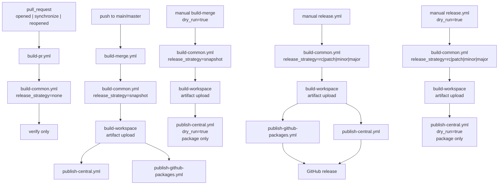

# How do the GitHub Actions workflows work?

This document explains the CI/CD workflow layout in `spring-nats`.

## Flow

## Workflows

### `build-pr.yml`

- Trigger: `pull_request` on `main` or `master`
- Also supports manual `workflow_dispatch`
- Calls `build-common.yml` with `release_strategy=none`
- Verifies build and tests only

### `build-merge.yml`

- Trigger: push to `main` or `master`
- Also supports manual `workflow_dispatch`
- Calls `build-common.yml` with `release_strategy=snapshot`
- Publishes snapshots on normal mainline runs
- With `dry_run=true`, only validates the Maven Central packaging path

### `release.yml`

- Trigger: manual `workflow_dispatch`
- Strategies: `rc`, `patch`, `minor`, `major`
- Publishes release artifacts on normal runs
- Creates the GitHub release after both publish jobs succeed
- With `dry_run=true`, only validates the Maven Central packaging path

### `build-common.yml`

This shared workflow:

1. checks out the target ref
2. reads Java metadata with `java-info-action`
3. resolves the workflow version
4. rewrites the Maven version with `versions:set`
5. clones and builds `nats-server`
6. runs `verify`
7. uploads the rewritten workspace for publish flows

### `publish-github-packages.yml`

- restores the build artifact
- restores the Maven wrapper executable bit
- publishes the existing modules with the normal Maven `deploy` path against GitHub Packages
- keeps the existing published artifact names:
  - `nats-spring-parent`
  - `nats-spring`
  - `nats-spring-boot-starter`
  - `nats-spring-cloud-stream-binder`

## Versioning

Version resolution is plain semver from the latest reachable tag:

- if no reachable semver tag exists, the workflow bootstraps from `0.0.0`
- `snapshot` resolves to the next snapshot version
- `rc`, `patch`, `minor`, and `major` resolve from the latest reachable tag
- historical Spring-line build metadata such as `+3.5` is not carried forward

With the current legacy tag line, the next manual `major` release resolves to `1.0.0`.

## Dry-run behavior

In this public repository, `dry_run=true` is intentionally conservative:

- runs the real build
- restores the real publish artifact
- validates the Maven Central packaging path
- does not publish GitHub Packages
- does not create a Git tag
- does not create a GitHub release

## Published artifacts

The workflow keeps the existing Maven Central artifact names:

- `nats-spring-parent`
- `nats-spring`
- `nats-spring-boot-starter`
- `nats-spring-cloud-stream-binder`

## Reproducible builds

The workflow passes `-Dproject.build.outputTimestamp` from the checked-out commit timestamp so build and publish use the same reproducible timestamp value.
