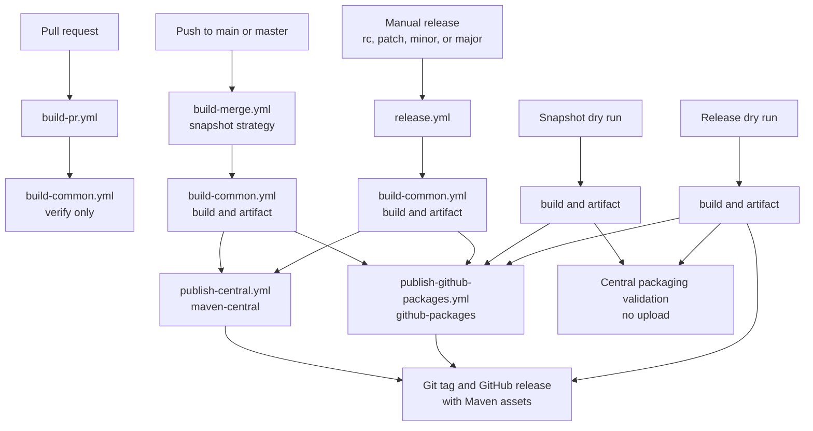

# How do the GitHub Actions workflows work?

## Flow

## What does each workflow do?

### `build-pr.yml`

- runs for opened, synchronized, and reopened pull requests
- resolves the next snapshot version from git tags
- builds NATS Server and runs `verify`
- never publishes

### `build-merge.yml`

- runs after a push to `main` or `master`
- publishes the next snapshot to Maven Central and GitHub Packages
- supports a manual dry run that skips Maven Central upload and exercises GitHub Packages and deployments

### `release.yml`

- runs manually with `rc`, `patch`, `minor`, or `major`
- serializes all releases through one concurrency slot
- publishes to Maven Central and GitHub Packages
- creates the git tag and GitHub release after both publishes succeed
- attaches the parent and starter POMs plus core and binder artifacts
- supports a manual dry run that skips Maven Central upload and creates the GitHub package, deployment, tag, release, and assets

### `build-common.yml`

- is callable only; public runs start through the pull-request, snapshot, or release workflows
- reads Java with `java-info-action`
- resolves versions from the latest reachable git tag with `semver-info-action`
- derives Go from the selected NATS Server `go.mod`
- builds NATS Server and runs Maven verification
- uploads the rewritten workspace for publish strategies
- retains the artifact for one day

### Publish workflows

- are callable only and consume the artifact from their caller's workflow run
- receive only the credentials required for their destination
- use the automatic `GITHUB_TOKEN` for GitHub Packages
- receive the four Maven Central and signing secrets explicitly for Central publishing

## How is the version selected?

The checked-in Maven version is not release truth. The workflow uses the latest reachable semver tag:

- `none` and `snapshot`: next patch snapshot
- `rc`: next release candidate
- `patch`, `minor`, `major`: corresponding stable version bump
- no tag: bootstrap from `0.0.0`

With the current `0.6.1+3.1` tag:

- snapshot: `0.6.2-SNAPSHOT`
- patch: `0.6.2`
- major: `1.0.0`

## What gets published?

Only these Maven coordinates are published:

- `io.nats:nats-spring-parent`
- `io.nats:nats-spring`
- `io.nats:nats-spring-boot-starter`
- `io.nats:nats-spring-cloud-stream-binder`

Samples are built and tested but never published.

## How are builds reproducible?

`project.build.outputTimestamp` comes from the checked-out commit timestamp. The same timestamp is passed to build and publish jobs with the verified workspace artifact.

## Which environments exist?

- `maven-central`
- `github-packages`

Dry runs enter both environments and create deployment records. The Central job validates release packaging without uploading; GitHub Packages and GitHub releases behave as live rehearsal targets.

## How is a partial release retried?

Use **Re-run failed jobs** on the original workflow run. Do not dispatch a new release: the original run preserves the resolved version and verified artifact.
