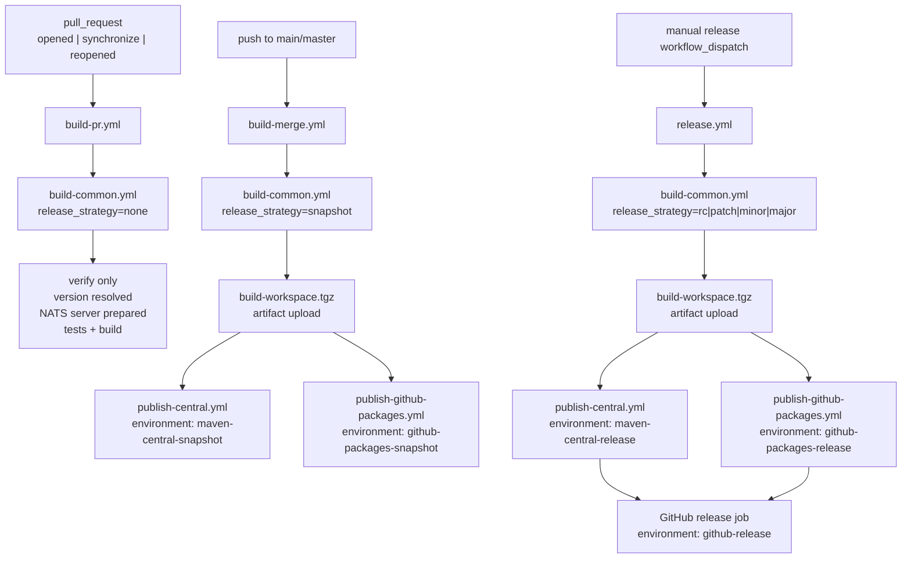

# How do the GitHub Actions workflows work?

This document explains the current CI/CD workflow layout in `spring-nats`.

## Flow

## What each workflow does

### `build-pr.yml`

- Trigger: `pull_request` on `main` or `master`
- Types: `opened`, `synchronize`, `reopened`
- Calls `build-common.yml` with `release_strategy=none`
- Runs normal CI only
- Does not publish
- Does not upload the rewritten workspace artifact

### `build-merge.yml`

- Trigger: push to `main` or `master`
- Also supports manual `workflow_dispatch`
- Calls `build-common.yml` with `release_strategy=snapshot`
- Produces the publishable workspace artifact
- Publishes snapshot outputs to:
  - Maven Central snapshot environment
  - GitHub Packages snapshot environment

### `release.yml`

- Trigger: manual `workflow_dispatch`
- Release strategies:
  - `rc`
  - `patch`
  - `minor`
  - `major`
- Calls `build-common.yml` with the selected strategy
- Produces the publishable workspace artifact
- Publishes release outputs to:
  - Maven Central release environment
  - GitHub Packages release environment
- Creates a GitHub release after both publish jobs succeed

### `build-common.yml`

This is the shared build pipeline.

It does the following:

1. Checks out the requested ref
2. Reads Java project metadata with `java-info-action`
3. Resolves the target project version from `release_strategy`
4. Rewrites the Maven version with `versions:set`
5. Clones and builds `nats-server`
6. Runs build and tests
7. For publish strategies only:
   - packages the workspace into `build-workspace.tgz`
   - uploads it as the `build-workspace` artifact

## Why there is a tarball inside the artifact

GitHub artifact upload already compresses files for storage and transfer, but it does not reliably preserve executable permissions. We tar the workspace before upload so restored files such as `mvnw` keep the expected file mode.

That tarball is the handoff between:

- the build job that determines version and produces artifacts
- the publish jobs that deploy exactly what was built

## Environments and deployments

The publish and release jobs use GitHub environments so they create deployment records in GitHub.

Current environment mapping:

- Snapshot publish to Central: `maven-central-snapshot`
- Snapshot publish to GitHub Packages: `github-packages-snapshot`
- Release publish to Central: `maven-central-release`
- Release publish to GitHub Packages: `github-packages-release`
- GitHub release creation: `github-release`

This makes release activity visible in GitHub Deployments instead of only in workflow logs.

## Version strategy notes

`build-common.yml` normalizes versions to plain semver for workflow builds and publishing.

The repository still contains historical Spring-line markers such as `+3.5`, but the workflow intentionally strips those and treats this as the Spring Boot 3 line from a release-version perspective.

Examples:

- `none` -> keep the current semver shape
- `snapshot` -> ensure `-SNAPSHOT`
- `rc` -> append `-rc.1`
- `patch|minor|major` -> bump the numeric core

Example normalization:

- project version `0.6.3+3.5-SNAPSHOT`
- workflow snapshot version `0.6.3-SNAPSHOT`
- workflow release version `0.6.3`
