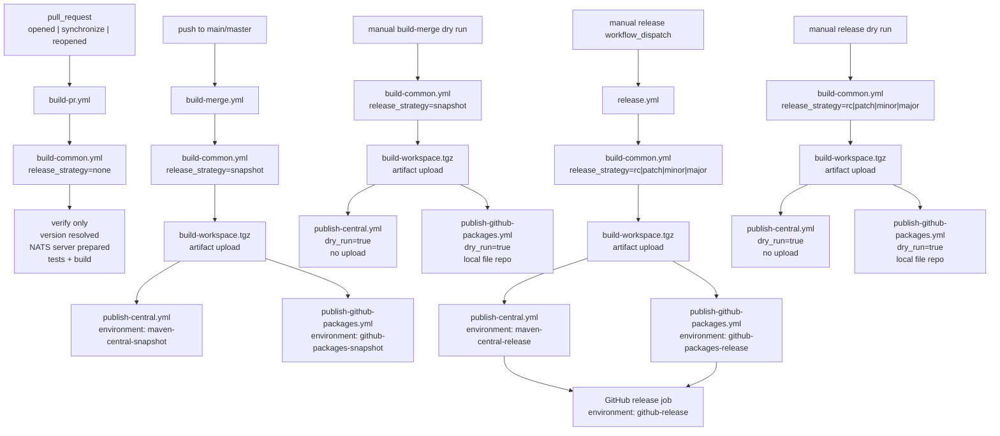

# How do the GitHub Actions workflows work?

This document explains the current CI/CD workflow layout in `spring-nats`.

## Flow

## What each workflow does

## Workflow capabilities

- automatic version resolution per workflow run
- automatic snapshot publishing on merges to `main` or `master`
- manual release publishing for `rc`, `patch`, `minor`, and `major`
- manual dry-run rehearsal for snapshot and release publishing
- git tag creation for release workflows
- GitHub release creation for manual releases
- publish to GitHub Packages
- publish to Maven Central
- GitHub environments for publish and release stages
- GitHub deployments for visible release activity

### `build-pr.yml`

- Trigger: `pull_request` on `main` or `master`
- Types: `opened`, `synchronize`, `reopened`
- Calls `build-common.yml` with `release_strategy=none`
- Runs normal CI only
- Does not publish
- Does not upload the rewritten workspace artifact

### `build-merge.yml`

- Trigger: push to `main` or `master`
- Also supports manual `workflow_dispatch`
- Manual dispatch supports `dry_run=true`
- Calls `build-common.yml` with `release_strategy=snapshot`
- Produces the publishable workspace artifact
- Publishes snapshot outputs to:
  - Maven Central snapshot environment
  - GitHub Packages snapshot environment
- With `dry_run=true`, rehearses Central packaging and deploys to a local file repository instead of publishing externally

### `release.yml`

- Trigger: manual `workflow_dispatch`
- Release strategies:
  - `rc`
  - `patch`
  - `minor`
  - `major`
- Supports `dry_run=true`
- Calls `build-common.yml` with the selected strategy
- Produces the publishable workspace artifact
- Publishes release outputs to:
  - Maven Central release environment
  - GitHub Packages release environment
- Creates a GitHub release after both publish jobs succeed
- Skips GitHub release creation when `dry_run=true`

### `build-common.yml`

This is the shared build pipeline.

It does the following:

1. Checks out the requested ref
2. Reads Java project metadata with `java-info-action`
3. Resolves the target project version from `release_strategy`
4. Rewrites the Maven version with `versions:set`
5. Clones and builds `nats-server`
6. Runs build and tests
7. For publish strategies only:
   - packages the workspace into `build-workspace.tgz`
   - uploads it as the `build-workspace` artifact

## Why there is a tarball inside the artifact

GitHub artifact upload already compresses files for storage and transfer, but it does not reliably preserve executable permissions. We tar the workspace before upload so restored files such as `mvnw` keep the expected file mode.

That tarball is the handoff between:

- the build job that determines version and produces artifacts
- the publish jobs that deploy exactly what was built

## Environments and deployments

The publish and release jobs use GitHub environments so they create deployment records in GitHub.

Current environment mapping:

- Snapshot publish to Central: `maven-central-snapshot`
- Snapshot publish to GitHub Packages: `github-packages-snapshot`
- Release publish to Central: `maven-central-release`
- Release publish to GitHub Packages: `github-packages-release`
- GitHub release creation: `github-release`
- Snapshot dry run to Central: `maven-central-snapshot-dry-run`
- Snapshot dry run to GitHub Packages: `github-packages-snapshot-dry-run`
- Release dry run to Central: `maven-central-release-dry-run`
- Release dry run to GitHub Packages: `github-packages-release-dry-run`

This makes release activity visible in GitHub Deployments instead of only in workflow logs.

## Version strategy notes

`build-common.yml` resolves the workflow version from the latest reachable git tag and the selected `release_strategy`, then rewrites the Maven version with `versions:set` for that run.

The checked-in Maven version is not used as release truth for workflow versioning.

The repository still contains historical Spring-line markers such as `+3.5`, but the workflow intentionally ignores those for version resolution and treats the latest git tag as the source of truth.

Examples:

- `none` -> use the next snapshot line from the latest tag
- `snapshot` -> use the next snapshot line from the latest tag
- `rc` -> append or increment `-rc.N` from the latest tag line
- `patch|minor|major` -> bump the numeric core from the latest tag

Example normalization:

- latest tag `0.6.1+3.1`
- workflow snapshot version `0.6.2-SNAPSHOT`
- workflow patch release version `0.6.2`

This means the workflow requires at least one existing tag in the repository before it can resolve versions.

## Dry run behavior

Dry runs use the same rewritten workspace artifact as live publish jobs, but stop before any external publication:

- `publish-central.yml` runs `./mvnw -B -Ppublish -DskipTests -Dgpg.skip=true -DskipPublishing=true package`
- `publish-github-packages.yml` deploys to a local file repository under `${RUNNER_TEMP}`
- `release.yml` skips GitHub release and tag creation when `dry_run=true`

This covers the important bits without leaving a trail of junk in public registries:

- snapshot version reuse and overwrite behavior
- RC, patch, minor, and major version resolution
- publish-from-artifact mechanics
- publish profile and javadoc wiring
